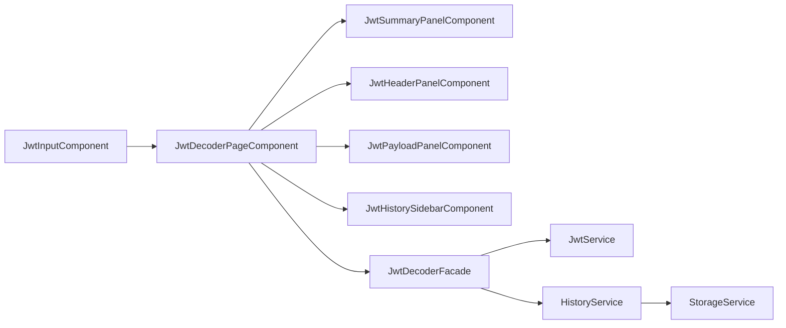
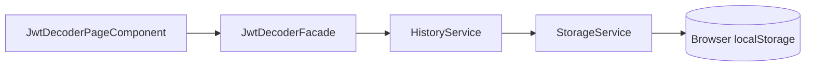

# Architecture - Decodificador de JWT

**Version:** v1.0
**Last Updated:** 2026-05-24
**Status:** Draft

---

## Introduction

This document defines the frontend architecture for the JWT Decoder product described in [docs/prd.md](docs/prd.md). The application is a local-first Angular + TypeScript single-page app with no backend, no database, and no external API dependencies. Its primary responsibility is to decode JWTs quickly, render them in a readable UI, and persist recent tokens in browser localStorage.

### Starter Template Decision

No existing starter template or repository foundation will be used. The project will start from Angular CLI with a clean greenfield structure, so all folders, services, and UI conventions are defined here and will be created manually during implementation.

---

## Technical Summary

The application will follow a feature-oriented monolith architecture inside a single Angular workspace. The UI is split into focused standalone components for input, decoded token display, and history management, while cross-cutting concerns are isolated into small services. JWT parsing and formatting are handled by a dedicated domain service, and persistence is abstracted behind a local storage service to keep browser API access isolated and testable.

The architecture is intentionally simple because the product has a narrow scope and must remain fast, offline-friendly, and easy to extend with additional developer tools later.

---

## High-Level Architecture

### Architecture Style

- Single-page frontend application
- Local-first architecture
- Feature-based modular structure
- Service-oriented domain logic
- No network boundary in the MVP

### Core Decisions

- Angular standalone components instead of a large NgModule hierarchy
- TypeScript as the only application language
- RxJS for reactive state and event streams where needed
- localStorage as the only persistence mechanism
- No API client layer, because the product has no backend

### Data Flow

1. User pastes a JWT into the input component.
2. The input component emits the token to the feature controller or facade.
3. The JWT service validates, parses, and decodes the token.
4. The decoded result is pushed to the view model.
5. The history service persists a compact recent-token record through the storage service.
6. The history sidebar renders stored items and allows reloading previous tokens.

---

## Technology Stack

| Category | Technology | Version | Purpose | Rationale |
| --- | --- | --- | --- | --- |
| Framework | Angular | 19.x | Frontend application framework | Strong component model, CLI support, and good fit for structured UI workflows |
| Language | TypeScript | 5.6.x | Application language | Type safety, maintainability, and strong Angular integration |
| Reactive Library | RxJS | 7.8.x | Reactive state and events | Native Angular ecosystem support and good fit for UI streams |
| Routing | Angular Router | 19.x | Application navigation | Lightweight routing if future tool pages are added |
| Styling | SCSS + CSS variables | Current Angular support | Component and theme styling | Clear theming model with low overhead |
| Build Tool | Angular CLI | 19.x | Build, serve, and test orchestration | Standard Angular developer experience |
| UI Pattern | Standalone Components | Angular 19 | Component composition | Lower boilerplate and simpler feature boundaries |
| Storage | Browser localStorage API | N/A | Persist recent JWT history | Matches the no-backend requirement |
| Testing | Jasmine + Karma or equivalent Angular test runner | Project default | Unit and integration tests | Stable Angular ecosystem baseline |
| Linting | ESLint | Current compatible version | Code quality | Enforces consistent TypeScript and Angular patterns |

---

## Project Structure

The project should use a feature-first structure that keeps the JWT tool isolated and makes future tools easy to add.

```text
src/
  app/
    core/
      models/
        jwt-header.model.ts
        jwt-payload.model.ts
        decoded-jwt.model.ts
        history-entry.model.ts
      services/
        jwt.service.ts
        storage.service.ts
        history.service.ts
      tokens/
        storage-keys.ts
      utils/
        base64url.util.ts
        date.util.ts
    shared/
      components/
        empty-state/
        error-banner/
        icon-button/
      pipes/
        pretty-json.pipe.ts
      utils/
        safe-json.util.ts
    features/
      jwt-decoder/
        components/
          jwt-input/
          jwt-payload-panel/
          jwt-header-panel/
          jwt-summary-panel/
          jwt-history-sidebar/
          jwt-actions-bar/
        containers/
          jwt-decoder-page/
        facades/
          jwt-decoder.facade.ts
        jwt-decoder.routes.ts
    app.component.ts
    app.routes.ts
  assets/
  styles/
    _theme.scss
    _tokens.scss
    global.scss
```

### Structure Rules

- `core` contains singleton services, models, and low-level utilities.
- `shared` contains reusable UI pieces and helpers with no feature-specific knowledge.
- `features/jwt-decoder` contains everything specific to the JWT tool.
- `containers` coordinate component composition and orchestration.
- `facades` hold feature state and derived view models when the UI becomes more complex.
- `tokens` store constant keys and storage names to avoid string duplication.

---

## Component Architecture

### App Shell

The application shell owns the layout and global navigation space.

Responsibilities:

- Render the main app frame
- Host the route outlet or feature page
- Provide global layout spacing and responsive breakpoints

Recommended component:

- `AppComponent`

### JWT Decoder Page

The feature container assembles the main decoding workflow.

Responsibilities:

- Coordinate input, result panels, and history
- Connect user events to the facade or services
- Keep the page state stable and predictable

Recommended component:

- `JwtDecoderPageComponent`

### Input Panel

The input panel is the primary entry point for the token.

Responsibilities:

- Accept pasted or typed JWT content
- Trigger decode on change or on explicit action
- Show validation feedback for malformed tokens

Recommended component:

- `JwtInputComponent`

### Token Display Panels

The token display area should be split into focused visual blocks.

Responsibilities:

- Show decoded header in a readable JSON block
- Show decoded payload in a readable JSON block
- Show summary metadata such as algorithm, issued-at, expiration, and status
- Present errors without breaking the layout

Recommended components:

- `JwtHeaderPanelComponent`
- `JwtPayloadPanelComponent`
- `JwtSummaryPanelComponent`
- `ErrorBannerComponent`

### History Sidebar

The sidebar gives quick access to recent decodes.

Responsibilities:

- List recent JWT entries from localStorage-backed state
- Reopen a previous token with one click
- Remove a single item
- Clear the full history

Recommended component:

- `JwtHistorySidebarComponent`

### Actions Bar

Optional action controls can live in a small toolbar area.

Responsibilities:

- Clear input
- Copy decoded JSON if needed later
- Clear history
- Provide compact utility actions

Recommended component:

- `JwtActionsBarComponent`

### Component Interaction Model



---

## Service Design

### 1. JwtService

This is the domain service responsible for understanding JWTs.

Responsibilities:

- Validate JWT shape
- Split token parts
- Decode Base64URL header and payload
- Parse JSON safely
- Derive summary metadata
- Detect expiration when payload contains `exp`

Suggested responsibilities by method:

- `isJwtFormat(token: string): boolean`
- `decode(token: string): DecodedJwt`
- `decodeHeader(part: string): JwtHeader`
- `decodePayload(part: string): JwtPayload`
- `getSummary(decoded: DecodedJwt): JwtSummary`
- `isExpired(exp?: number): boolean`

Design rules:

- Never throw raw parse errors into the UI.
- Convert all failures into typed domain errors.
- Keep browser API access out of this service.
- Keep decoding pure and deterministic so it is easy to test.

### 2. StorageService

This service is the only layer allowed to speak directly to localStorage.

Responsibilities:

- Read values by key
- Write values by key
- Remove values by key
- Handle JSON serialization and parsing
- Guard against unavailable storage access
- Recover gracefully from corrupted stored data

Suggested API:

- `get<T>(key: string, fallback: T): T`
- `set<T>(key: string, value: T): void`
- `remove(key: string): void`
- `has(key: string): boolean`
- `clearNamespace(prefix: string): void`

Design rules:

- Wrap all localStorage access in try/catch.
- Treat storage as optional if the browser blocks access.
- Never let malformed JSON crash the app.
- Use namespaced keys to avoid collisions.

### 3. HistoryService

This service manages recent token history as application state.

Responsibilities:

- Add new successful decode results to history
- Deduplicate or move recent items to the top
- Limit the history size
- Remove individual entries
- Clear all history
- Hydrate and persist through StorageService

Suggested API:

- `loadHistory(): HistoryEntry[]`
- `addEntry(entry: HistoryEntry): void`
- `removeEntry(id: string): void`
- `clearHistory(): void`
- `selectEntry(id: string): HistoryEntry | undefined`

Suggested history rules:

- Store only a compact record, not duplicate large derived objects.
- Keep the latest items at the top.
- Cap the list at a small number such as 20 or 50 entries.
- Persist after every meaningful change.

### 4. JwtDecoderFacade

This optional facade coordinates the page state and simplifies component communication.

Responsibilities:

- Hold the current input token
- Expose decoded result and error state
- Connect JwtService and HistoryService
- Provide a small state surface for the page component

This is especially useful if the page starts to accumulate more UI states such as empty, loading, invalid, or history-selected.

---

## Data Models

### JwtHeader

Represents the decoded header payload.

Fields:

- `alg`
- `typ`
- `kid`
- additional custom claims if present

### JwtPayload

Represents the decoded application payload.

Fields:

- `sub`
- `iss`
- `aud`
- `exp`
- `iat`
- `nbf`
- additional custom claims if present

### DecodedJwt

Represents the full decode result.

Fields:

- original token
- header object
- payload object
- signature part
- decode timestamp
- validation state
- summary metadata

### HistoryEntry

Represents one stored history item.

Fields:

- `id`
- `token`
- `label`
- `createdAt`
- `lastOpenedAt`
- `expiresAt`
- `algorithm`

---

## localStorage Integration Design

### Storage Keys

Use explicit namespacing for all persistence keys.

Suggested keys:

- `jwt-decoder.history.v1`
- `jwt-decoder.settings.v1`

### Persistence Strategy

- Read history once during app bootstrap or facade initialization.
- Write history after successful decode, removal, or clear.
- Keep the stored schema versioned.
- Ignore or reset invalid data instead of failing hard.

### Failure Handling

The app should tolerate these cases:

- localStorage unavailable
- quota exceeded
- invalid JSON persisted from a previous version
- corrupted entries added by manual browser edits

### Storage Flow



---

## Routing

The MVP can start with a single route and still keep routing enabled for future tools.

Suggested routes:

- `/` - JWT decoder home
- `/history` - optional shortcut route later if the sidebar becomes a full page

If the product grows into a small suite of productivity tools, this structure can expand without changing the core decoder domain.

---

## Styling Approach

- Use SCSS for component styling and design tokens.
- Keep layout styles in the feature container and shell.
- Use CSS custom properties for spacing, colors, and typography.
- Prefer high-contrast readable panels over decorative complexity.
- Keep the history sidebar visually distinct from the main decoding area.

Suggested visual layout:

- Left or right sidebar for history
- Main content column for input and decode panels
- Compact summary strip near the top of the result area

---

## Critical Coding Rules

- Keep JWT parsing logic isolated in the domain service.
- Do not access localStorage directly from components.
- Do not let parse errors leak into templates.
- Keep view models small and serializable.
- Make all history updates idempotent and predictable.
- Avoid introducing state management libraries unless the feature set expands.

---

## Implementation Notes for Angular

- Prefer standalone components.
- Use `inject()` instead of constructor injection where it improves readability.
- Keep component inputs and outputs explicit.
- Use `OnPush` change detection for presentational components.
- Use a facade or lightweight reactive state if the page state grows beyond simple inputs.

---

## Open Questions for Later Expansion

- Should history entries store only raw tokens or also the derived summary snapshot?
- Should the decoder auto-run on paste or require an explicit button click?
- Should the app support multiple named workspaces or presets in later versions?

---

## Change Log

| Date | Version | Description | Author |
| --- | --- | --- | --- |
| 2026-05-24 | v1.0 | Initial frontend architecture for the JWT Decoder | @architect |

---

_Last Updated: 2026-05-24 | AIOX Framework Team_
